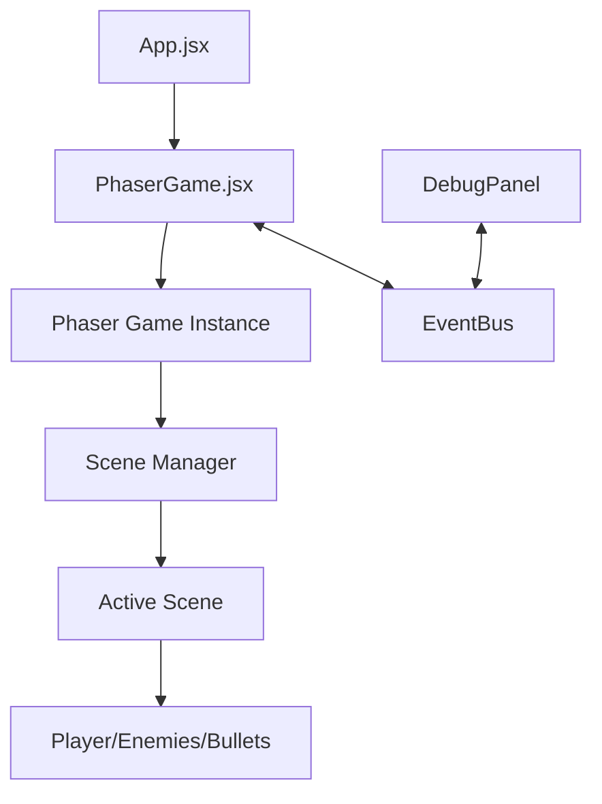

# Fluffy-Swizz Interactive Game Project Documentation

## Table of Contents
- [Project Overview](#project-overview)
- [Architecture](#architecture)
- [Core Components](#core-components)
- [Game Entities](#game-entities)
- [Scene Management](#scene-management)
- [Event System](#event-system)
- [UI Components](#ui-components)
- [Development Guidelines](#development-guidelines)

## Project Overview

A top-down shooter game built with Phaser 3 and React. Players can choose between two weapon modes (minigun or shotgun) and must survive as long as possible against increasingly difficult waves of enemies.

### Tech Stack
- **Game Engine**: Phaser 3.88.2
- **UI Framework**: React 18.3.1
- **Build Tool**: Vite 5.3.1

### Key Game Features
- Two distinct weapon systems
- Enemy wave management with increasing difficulty
- Boss enemy encounters
- Debug panel for development

---

## Architecture

### Project Structure

```
src/
├── App.jsx                # Main React entry point
├── main.jsx               # React initialization
└── game/                  # Game logic
    ├── EventBus.js        # Events communication system
    ├── main.js            # Phaser game initialization
    ├── PhaserGame.jsx     # React-Phaser integration
    ├── debug/             # Debug tools
    │   └── DebugPanel.jsx # In-game debug panel
    ├── entities/          # Game objects
    │   ├── Enemy.js       # Enemy entity
    │   └── Player.js      # Player entity
    └── scenes/            # Game screens
        ├── Boot.js        # Initial loading
        ├── Game.jsx       # Main gameplay
        ├── GameOver.js    # End screen
        ├── MainMenu.js    # Menu screen
        └── Preloader.js   # Asset loading
```

### Data Flow



---

## Core Components

### `PhaserGame.jsx`

React component that initializes and manages the Phaser game instance.

#### Methods
- `initializeGame()` - Creates a new Phaser game instance
- `cleanupGame()` - Destroys the game instance when unmounting
- `setupEventListeners()` - Sets up EventBus listeners
- `handleSceneReady(currentScene)` - Handles scene initialization events

#### Props
- `ref` - Forwarded ref to access game and scene objects

### `main.js`

Initializes the Phaser game with appropriate configuration.

#### Configuration Options
- `width: 1024` - Game canvas width
- `height: 768` - Game canvas height
- `physics: { default: 'arcade' }` - Physics engine
- `fps: { target: 60 }` - Target framerate
- `backgroundColor: '#028af8'` - Default background color

#### Game Scenes
- `Boot` - Initial loading
- `Preloader` - Asset loading
- `MainMenu` - Game menu
- `Game` - Main gameplay
- `GameOver` - End screen

### `EventBus.js`

Communication system between React components and Phaser scenes using Phaser's built-in event emitter.

#### Methods
- `EventBus.emit(key, data)` - Trigger an event with optional data
- `EventBus.on(key, callback, context)` - Listen for events
- `EventBus.removeListener(key, callback, context)` - Remove event listeners

#### Key Events
- `'current-scene-ready'` - Emitted when a scene is fully initialized
- `'preloader-complete'` - Emitted when asset loading is finished

---

## Game Entities

### `Player` Class (`Player.js`)

Manages the player character, including movement, weapons, and shooting.

#### Properties
- `speed: 3` - Movement speed
- `radius: 20` - Player collision radius
- `health: 100` - Player health
- `gameMode` - Current weapon type ('minigun' or 'shotgun')

#### Methods
- `constructor(scene, x, y)` - Creates player at specified position
- `initPhysicsProperties()` - Sets up movement-related properties
- `initWeaponProperties(gameMode)` - Configures weapon based on game mode
- `initGraphics(x, y)` - Creates visual elements
- `update()` - Called each frame to update player state
- `updateMovement()` - Handles player movement
- `updateAiming()` - Updates aim direction based on mouse
- `shoot()` - Fires weapon based on current mode
- `createBullet(spawnX, spawnY, dirX, dirY)` - Creates appropriate bullet type
- `createMinigunBullet(spawnX, spawnY, dirX, dirY)` - Creates single bullet
- `createShotgunBullets(spawnX, spawnY, dirX, dirY)` - Creates spread of bullets
- `calculateDirectionVector()` - Gets normalized direction to target
- `getPosition()` - Returns current coordinates

#### Weapon Types
- **Minigun**
  - Fast fire rate (10ms)
  - Medium damage (30)
  - Yellow bullets
- **Shotgun**
  - Slow fire rate (40ms)
  - Multiple bullets per shot (10)
  - 30-degree spread
  - Orange bullets

### `Enemy` Class (`Enemy.js`)

Manages enemy entities including movement, collision, and boss variants.

#### Properties
- `speed` - Movement speed (0.5 for normal, 0.3 for boss)
- `size` - Enemy size (15 for normal, 50 for boss)
- `health` - Health points (10 for normal, 10000 for boss)
- `isBoss` - Boolean flag for boss enemies

#### Methods
- `constructor(scene, x, y, isBoss = false)` - Creates enemy
- `initProperties()` - Sets up properties based on enemy type
- `createVisuals(x, y)` - Creates graphics
- `update()` - Called each frame to update enemy state
- `moveTowardsPlayer(playerPos)` - Handles enemy movement toward player
- `checkPlayerCollision(playerPos)` - Checks for player collision
- `takeDamage(damage)` - Applies damage and visual feedback
- `die()` - Handles death, increments kill counter
- `manageHealthBar(create)` - Creates or updates health bar for bosses
- `createHealthBar()` - Creates initial health bar
- `updateHealthBar()` - Updates health bar position and width

---

## Scene Management

### `Boot` Scene (`Boot.js`)

Initial scene that loads minimal assets required for the preloader.

#### Methods
- `preload()` - Loads background image
- `create()` - Transitions to Preloader scene

### `Preloader` Scene (`Preloader.js`)

Handles loading of all game assets with a progress bar.

#### Methods
- `init()` - Sets up loading screen
- `preload()` - Loads all game assets
- `create()` - Transitions to MainMenu scene

#### Assets Loaded
- Game images (logo, background)
- Tilemap data
- Tileset images

### `MainMenu` Scene (`MainMenu.js`)

Game start screen with weapon selection options.

#### Methods
- `create()` - Sets up menu UI elements
- `changeScene(gameMode)` - Starts game with selected weapon mode
- `moveLogo(reactCallback)` - Animates logo (demo feature)

### `Game` Scene (`Game.jsx`)

Main gameplay scene handling game loop, entities, and mechanics.

#### Properties
- `gameMode` - Selected weapon type
- `enemySpawnRate` - Time between enemy spawns (decreases over time)
- `enemyList` - Array of active enemies
- `killCount` - Number of enemies defeated
- `survivalTime` - Time survived in seconds

#### Methods
- `init(data)` - Initializes scene with selected game mode
- `resetGameState()` - Resets game variables for new game
- `create()` - Sets up the map, player, and systems
- `setupMap()` - Creates and scales the game map
- `setupGameObjects()` - Creates player and entity groups
- `setupCamera()` - Configures camera to follow player
- `setupUI()` - Creates UI elements
- `setupInput()` - Sets up keyboard and mouse input
- `update(time, delta)` - Main game loop
- `updateGameTimers(delta)` - Updates time-based metrics
- `updateGameObjects()` - Updates player, bullets, enemies
- `updateBullets()` - Manages bullet movement and lifetime
- `updateEnemies()` - Manages enemy behavior
- `checkCollisions()` - Detects and handles collisions
- `spawnEnemy()` - Creates new enemy at appropriate position
- `spawnEnemyGroup()` - Creates group of 3-6 enemies together
- `spawnBoss()` - Creates boss enemy
- `updateDifficulty()` - Increases difficulty over time
- `playerDeath()` - Handles player death
- `setPauseState(isPaused, reason)` - Manages game pause functionality
- `togglePause()` - Toggles pause state
- `createEnemyDeathEffect(x, y)` - Visual effects for enemy death
- `createBossDeathEffect(x, y)` - Visual effects for boss death
- `showBossWarning()` - Displays boss warning message

### `GameOver` Scene (`GameOver.js`)

End screen showing game results and offering restart option.

#### Methods
- `init(data)` - Receives survival time and kill count
- `create()` - Sets up game over UI
- `changeScene()` - Returns to main menu

---

## UI Components

### `DebugPanel` Component (`DebugPanel.jsx`)

React component displaying real-time game metrics for development.

#### Props
- `gameRef` - Reference to the PhaserGame component

#### State
- `debugInfo` - Object containing current game metrics

#### Methods
- `updateDebugInfo()` - Updates displayed metrics
- `renderSection(title, children)` - Helper to render UI sections
- `renderInfoItem(label, value)` - Helper to render individual metrics

#### Displayed Information
- FPS
- Enemy count
- Bullet count
- Player position
- Mouse position
- Kill count
- Game mode
- Survival time

---

## Development Guidelines

### Adding a New Enemy Type

1. Extend the Enemy class with your new enemy type
2. Override `initProperties()` to set specific attributes
3. Add spawn logic in Game.jsx's enemy spawning system
4. Add collision detection if needed

### Implementing a New Weapon

1. Add a new weapon type in MainMenu.jsx UI
2. Extend Player.js `initWeaponProperties()` for the new weapon
3. Create a custom bullet creation method
4. Add weapon-specific effects if needed

### Creating a New Power-Up

1. Create a new class for the power-up
2. Add spawn logic in Game.jsx
3. Implement collision detection with player
4. Add effect application to player properties

### Debugging Tips

1. Use the Debug Panel to monitor game state
2. Add temporary visual indicators for hitboxes during development
3. Use `console.log()` with descriptive tags for tracking specific systems
4. Test performance with different enemy counts to find bottlenecks

---

## Asset Management

### Required Assets

- `logo.png` - Game logo
- `bg.png` - Background image
- `scifi_tiles.png` - Tileset for the map
- `map.json` - Tilemap data
- `favicon.png` - Browser tab icon
- `particle_texture.png` - Texture for particle effects

---

*This documentation is maintained by the Fluffy-Swizz Interactive development team.*