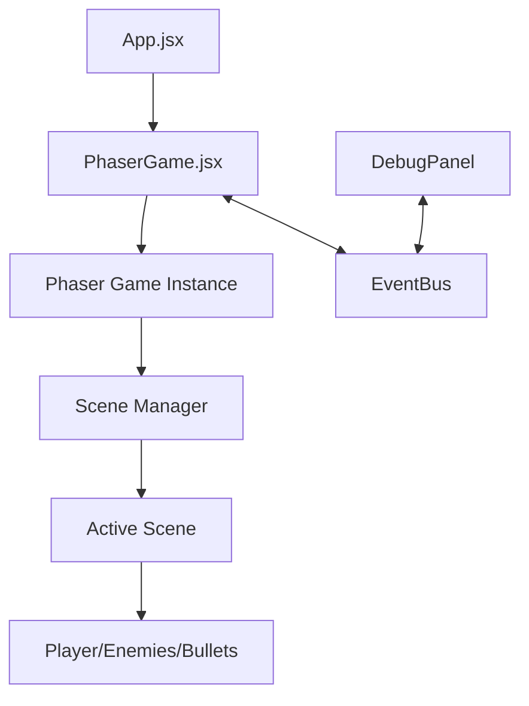

# Fluffy-Swizz Interactive Game Project Documentation

## Table of Contents
- [Project Overview](#project-overview)
- [Architecture](#architecture)
- [Core Components](#core-components)
- [Game Entities](#game-entities)
- [Scene Management](#scene-management)
- [Event System](#event-system)
- [UI Components](#ui-components)
- [Sound System](#sound-system)
- [Game Mechanics](#game-mechanics)
- [Mapping System](#mapping-system)
- [Development Guidelines](#development-guidelines)
- [Asset Management](#asset-management)
- [Troubleshooting](#troubleshooting)

## Project Overview

A top-down shooter game built with Phaser 3 and React. Players can choose between two weapon modes (minigun or shotgun) and must survive as long as possible against increasingly difficult waves of enemies.

### Tech Stack
- **Game Engine**: Phaser 3.88.2
- **UI Framework**: React 18.3.1
- **Build Tool**: Vite 5.3.1

### Key Game Features
- Two distinct weapon systems
- Enemy wave management with increasing difficulty
- Boss enemy encounters
- Debug panel for development

---

## Architecture

### Project Structure

```
src/
├── App.jsx                # Main React entry point
├── main.jsx               # React initialization
└── game/                  # Game logic
    ├── EventBus.js        # Events communication system
    ├── main.js            # Phaser game initialization
    ├── PhaserGame.jsx     # React-Phaser integration
    ├── debug/             # Debug tools
    │   └── DebugPanel.jsx # In-game debug panel
    ├── entities/          # Game objects
    │   ├── Enemy.js       # Enemy entity
    │   └── Player.js      # Player entity
    ├── sound/             # Sound management
    │   └── SoundManager.js # Centralized audio system
    ├── mapping/           # Tilemap management
    │   └── tileMapManager.jsx # Modular tilemap service
    └── scenes/            # Game screens
        ├── Boot.js        # Initial loading
        ├── Game.jsx       # Main gameplay
        ├── GameOver.js    # End screen
        ├── MainMenu.js    # Menu screen
        └── Preloader.js   # Asset loading
```

### Data Flow



---

## Core Components

### `PhaserGame.jsx`

React component that initializes and manages the Phaser game instance.

#### Methods
- `initializeGame()` - Creates a new Phaser game instance
- `cleanupGame()` - Destroys the game instance when unmounting
- `setupEventListeners()` - Sets up EventBus listeners
- `handleSceneReady(currentScene)` - Handles scene initialization events

#### Props
- `ref` - Forwarded ref to access game and scene objects

### `main.js`

Initializes the Phaser game with appropriate configuration.

#### Configuration Options
- `width: 1024` - Game canvas width
- `height: 768` - Game canvas height
- `physics: { default: 'arcade' }` - Physics engine
- `fps: { target: 60 }` - Target framerate
- `backgroundColor: '#028af8'` - Default background color

#### Game Scenes
- `Boot` - Initial loading
- `Preloader` - Asset loading
- `MainMenu` - Game menu
- `Game` - Main gameplay
- `GameOver` - End screen

### `EventBus.js`

Communication system between React components and Phaser scenes using Phaser's built-in event emitter.

#### Methods
- `EventBus.emit(key, data)` - Trigger an event with optional data
- `EventBus.on(key, callback, context)` - Listen for events
- `EventBus.removeListener(key, callback, context)` - Remove event listeners

#### Key Events
- `'current-scene-ready'` - Emitted when a scene is fully initialized
- `'preloader-complete'` - Emitted when asset loading is finished

---

## Game Entities

### `Player` Class (`Player.js`)

Manages the player character, including movement, weapons, and shooting.

#### Properties
- `speed: 3` - Movement speed
- `radius: 20` - Player collision radius
- `health: 100` - Player health
- `gameMode` - Current weapon type ('minigun' or 'shotgun')

#### Methods
- `constructor(scene, x, y)` - Creates player at specified position
- `initPhysicsProperties()` - Sets up movement-related properties
- `initWeaponProperties(gameMode)` - Configures weapon based on game mode
- `initGraphics(x, y)` - Creates visual elements
- `update()` - Called each frame to update player state
- `updateMovement()` - Handles player movement
- `updateAiming()` - Updates aim direction based on mouse
- `shoot()` - Fires weapon based on current mode
- `createBullet(spawnX, spawnY, dirX, dirY)` - Creates appropriate bullet type
- `createMinigunBullet(spawnX, spawnY, dirX, dirY)` - Creates single bullet
- `createShotgunBullets(spawnX, spawnY, dirX, dirY)` - Creates spread of bullets
- `calculateDirectionVector()` - Gets normalized direction to target
- `getPosition()` - Returns current coordinates

#### Weapon Types
- **Minigun**
  - Fast fire rate (10ms)
  - Medium damage (30)
  - Yellow bullets
- **Shotgun**
  - Slow fire rate (40ms)
  - Multiple bullets per shot (10)
  - 30-degree spread
  - Orange bullets

#### Audio Integration

The Player class integrates with the SoundManager to play appropriate weapon sounds when shooting:

```javascript
// In Player.js - initSounds method
initSounds() {
    // Check if soundManager exists
    if (!this.scene.soundManager) {
        console.warn('SoundManager not found in scene. Weapon sounds will not be played.');
        return;
    }

    // Use the sound effects that have already been initialized by the scene
    if (this.gameMode === 'minigun') {
        this.soundKey = 'shoot_minigun';
    } else if (this.gameMode === 'shotgun') {
        this.soundKey = 'shoot_shotgun';
    }
}

// In the shoot method
playWeaponSound() {
    if (!this.scene.soundManager || !this.soundKey) return;
    
    try {
        const detune = Math.random() * 200 - 100;
        
        // Force unlock on first shot if needed
        if (!this.hasPlayedSound && this.scene.sound.locked) {
            this.scene.sound.unlock();
        }
        
        this.scene.soundManager.playSoundEffect(this.soundKey, { detune });
        this.hasPlayedSound = true;
    } catch (error) {
        console.warn('Error playing weapon sound:', error);
    }
}
```

This approach follows the best practice of centralized audio management through the SoundManager.

### `Enemy` Class (`Enemy.js`)

Manages enemy entities including movement, collision, and boss variants.

#### Properties
- `speed` - Movement speed (0.5 for normal, 0.3 for boss)
- `size` - Enemy size (15 for normal, 50 for boss)
- `health` - Health points (10 for normal, 10000 for boss)
- `isBoss` - Boolean flag for boss enemies

#### Methods
- `constructor(scene, x, y, isBoss = false)` - Creates enemy
- `initProperties()` - Sets up properties based on enemy type
- `createVisuals(x, y)` - Creates graphics
- `update()` - Called each frame to update enemy state
- `moveTowardsPlayer(playerPos)` - Handles enemy movement toward player
- `checkPlayerCollision(playerPos)` - Checks for player collision
- `takeDamage(damage)` - Applies damage and visual feedback
- `die()` - Handles death, increments kill counter
- `manageHealthBar(create)` - Creates or updates health bar for bosses
- `createHealthBar()` - Creates initial health bar
- `updateHealthBar()` - Updates health bar position and width

---

## Scene Management

### `Boot` Scene (`Boot.js`)

Initial scene that loads minimal assets required for the preloader.

#### Methods
- `preload()` - Loads background image
- `create()` - Transitions to Preloader scene

### `Preloader` Scene (`Preloader.js`)

Handles loading of all game assets with a progress bar.

#### Methods
- `init()` - Sets up loading screen
- `preload()` - Loads all game assets
- `create()` - Transitions to MainMenu scene

#### Assets Loaded
- Game images (logo, background)
- Tilemap data
- Tileset images

### `MainMenu` Scene (`MainMenu.js`)

Game start screen with weapon selection options.

#### Methods
- `create()` - Sets up menu UI elements
- `changeScene(gameMode)` - Starts game with selected weapon mode
- `moveLogo(reactCallback)` - Animates logo (demo feature)

### `Game` Scene (`Game.jsx`)

Main gameplay scene handling game loop, entities, and mechanics.

#### Properties
- `gameMode` - Selected weapon type
- `enemySpawnRate` - Time between enemy spawns (decreases over time)
- `enemyList` - Array of active enemies
- `killCount` - Number of enemies defeated
- `survivalTime` - Time survived in seconds

#### Methods
- `init(data)` - Initializes scene with selected game mode
- `resetGameState()` - Resets game variables for new game
- `create()` - Sets up the map, player, and systems
- `setupMap()` - Creates and scales the game map
- `setupGameObjects()` - Creates player and entity groups
- `setupCamera()` - Configures camera to follow player
- `setupUI()` - Creates UI elements
- `setupInput()` - Sets up keyboard and mouse input
- `update(time, delta)` - Main game loop
- `updateGameTimers(delta)` - Updates time-based metrics
- `updateGameObjects()` - Updates player, bullets, enemies
- `updateBullets()` - Manages bullet movement and lifetime
- `updateEnemies()` - Manages enemy behavior
- `checkCollisions()` - Detects and handles collisions
- `spawnEnemy()` - Creates new enemy at appropriate position
- `spawnEnemyGroup()` - Creates group of 3-6 enemies together
- `spawnBoss()` - Creates boss enemy
- `updateDifficulty()` - Increases difficulty over time
- `playerDeath()` - Handles player death
- `setPauseState(isPaused, reason)` - Manages game pause functionality
- `togglePause()` - Toggles pause state
- `createEnemyDeathEffect(x, y)` - Visual effects for enemy death
- `createBossDeathEffect(x, y)` - Visual effects for boss death
- `showBossWarning()` - Displays boss warning message

### `GameOver` Scene (`GameOver.js`)

End screen showing game results and offering restart option.

#### Methods
- `init(data)` - Receives survival time and kill count
- `create()` - Sets up game over UI
- `changeScene()` - Returns to main menu

---

## UI Components

### `DebugPanel` Component (`DebugPanel.jsx`)

React component displaying real-time game metrics for development.

#### Props
- `gameRef` - Reference to the PhaserGame component

#### State
- `debugInfo` - Object containing current game metrics

#### Methods
- `updateDebugInfo()` - Updates displayed metrics
- `renderSection(title, children)` - Helper to render UI sections
- `renderInfoItem(label, value)` - Helper to render individual metrics

#### Displayed Information
- FPS
- Enemy count
- Bullet count
- Player position
- Mouse position
- Kill count
- Game mode
- Survival time

---

## Sound System

Handles audio playback for game events and background music.

### `SoundManager` Class (`sound/SoundManager.js`)

Centralized audio system that manages both background music and sound effects.

#### Properties
- `musicTracks` - Object storing all background music tracks
- `soundEffects` - Object storing all sound effects
- `currentMusic` - Reference to the currently playing music track
- `musicVolume` - Volume level for background music (0-1)
- `effectsVolume` - Volume level for sound effects (0-1)
- `isMuted` - Boolean flag for mute state

#### Methods
- `constructor(scene)` - Initializes sound manager for a specific scene
- `initBackgroundMusic(key, options)` - Registers a music track with options
- `playMusic(key, options)` - Plays a music track with optional crossfade
- `startNewMusic(key, fadeInDuration, delay)` - Starts new music with fade in
- `stopMusic(fadeOutDuration)` - Stops current music with optional fade out
- `pauseMusic()` - Pauses current music playback
- `resumeMusic()` - Resumes paused music
- `setMute(mute)` - Sets the mute state for all audio
- `toggleMute()` - Toggles between muted and unmuted states
- `setMusicVolume(volume)` - Sets volume level for all music tracks
- `setEffectsVolume(volume)` - Sets volume level for sound effects
- `initSoundEffect(key, options)` - Registers a sound effect with options
- `playSoundEffect(key, options)` - Plays a sound effect with options
- `destroy()` - Cleans up all audio resources

#### Usage Example

```javascript
// Create sound manager in a scene
this.soundManager = new SoundManager(this);

// Register background music
this.soundManager.initBackgroundMusic('ambient_music', {
    volume: 0.4,
    loop: true
});

// Play music with fade in
this.soundManager.playMusic('ambient_music', {
    fadeIn: 2000  // 2 second fade in
});

// Register sound effect
this.soundManager.initSoundEffect('explosion', {
    volume: 0.7,
    rate: 1.2
});

// Play sound effect with options
this.soundManager.playSoundEffect('explosion', {
    detune: Math.random() * 200 - 100
});
```

### Audio Pause Handling

The audio system has been enhanced with an improved implementation for handling background music when the game is paused:

```javascript
pauseMusic() {
    if (this.currentMusic) {
        // Store the current music state and position
        this._musicWasPlaying = this.currentMusic.isPlaying;
        
        if (this._musicWasPlaying) {
            // Store information needed to resume properly
            this._originalVolume = this.currentMusic.volume;
            this._musicKey = this._getMusicKeyByTrack(this.currentMusic);
            this._seekPosition = this.currentMusic.seek; // Store current position
            
            // Cancel any existing volume tweens to prevent conflicts
            this.scene.tweens.killTweensOf(this.currentMusic);
            
            // Stop the music completely
            this.currentMusic.stop();
            
            // For extra safety, directly pause the WebAudio node
            if (this.scene.sound.context && !this.scene.sound.context.suspended) {
                this.scene.sound.pauseAll();
            }
        }
    }
}

resumeMusic() {
    // Only resume if we specifically paused the music
    if (this._musicPaused && this._musicWasPlaying && this._musicKey) {
        // Resume the WebAudio context if it was suspended
        if (this.scene.sound.context && this.scene.sound.context.suspended) {
            this.scene.sound.resumeAll();
        }
        
        // Get the track and restart it from where it was paused
        const track = this.musicTracks[this._musicKey];
        if (track) {
            this.currentMusic = track;
            this.currentMusic.play({
                loop: true,
                volume: this._originalVolume || this.musicVolume,
                seek: this._seekPosition || 0
            });
        }
        
        // Clear the pause state
        this._musicPaused = false;
        this._musicWasPlaying = false;
        this._originalVolume = null;
        this._seekPosition = 0;
        this._musicKey = null;
    }
}
```

This implementation ensures that background music properly stops during game pause and resumes from the exact position when the game is unpaused:

1. **Position tracking**: The system now tracks the exact playback position when pausing
2. **WebAudio API integration**: Uses Phaser's lower-level audio APIs for more reliable control
3. **State management**: Properly manages state across pause/resume cycles
4. **Error handling**: Provides graceful fallbacks if tracks can't be found
5. **Tween cleanup**: Prevents volume tween conflicts when rapidly pausing/resuming

The solution follows OOP principles with proper private helper methods and maintains all state internally in the SoundManager class.

### Sound Assets
- `ambient_music`: Looping background music for atmosphere
- `shoot_minigun`: Sound played when firing the minigun weapon
- `shoot_shotgun`: Sound played when firing the shotgun weapon

### Audio Implementation

#### Main Menu
The `MainMenu` scene initializes the ambient music that continues throughout the game:

1. **Scene Initialization Order**:
   ```javascript
   setupSoundManager() {
       this.soundManager = new SoundManager(this);
       this.soundManager.initBackgroundMusic('ambient_music', {
        volume: 0.3,
        loop: true
    });
    this.soundManager.playMusic('ambient_music', {
        fadeIn: 3000
    });}


2.  **The `Game` scene continues the ambient music and handles pausing during gameplay**: 

   ```javascript
   setupSoundManager() {
       this.soundManager = new SoundManager(this);
       
       // Initialize audio assets
       this.soundManager.initBackgroundMusic('ambient_music', {
           volume: 0.4,
           loop: true
       });
       
       this.soundManager.initSoundEffect('shoot_minigun', {
           volume: 0.5,
           rate: 1.0
       });
       
       this.soundManager.initSoundEffect('shoot_shotgun', {
           volume: 0.6,
           rate: 0.9
       });
       
       // Handle audio context locking
       if (this.sound.locked) {
           console.debug('Audio system is locked. Attempting to unlock...');
           this.sound.once('unlocked', () => {
               this.soundManager.playMusic('ambient_music', {
                   fadeIn: 2000
               });
           });
       } else {
           this.soundManager.playMusic('ambient_music', {
               fadeIn: 2000
           });
       }
   }
   ```

3. **Robust Sound Playback**:
   The SoundManager's `playSoundEffect` method includes comprehensive error handling to ensure reliable sound playback across browsers:

   ```javascript
   playSoundEffect(key, options = {}) {
       // On-demand initialization for missing sounds
       if (!this.soundEffects[key] && this.scene.cache.audio.exists(key)) {
           this.initSoundEffect(key, { volume: this.effectsVolume, rate: 1.0 });
       }

       // Handle locked audio context
       if (this.scene.sound.locked) {
           this.scene.sound.once('unlocked', () => {
               if (this.soundEffects[key]) {
                   this.soundEffects[key].play(options);
               }
           });
           this.scene.sound.unlock();
           return null;
       }
       
       // Safe playback with try/catch
       try {
           return this.soundEffects[key].play(options);
       } catch (error) {
           console.warn(`Error playing sound "${key}":`, error);
           return null;
       }
   }
   ```

These implementation details ensure that sounds play reliably across different browsers and handle common edge cases like audio context locking.

---

## Game Mechanics

### Weapon Systems

#### Minigun
- Fast firing rate (100 shots/sec)
- Lower damage per shot
- Good for consistent damage output
- Yellow projectiles

#### Shotgun
- Slow firing rate (25 shots/sec)
- Multiple projectiles per shot
- High burst damage
- Good for close encounters
- Orange projectiles

### Enemy Spawning

Enemies spawn at increasing rates as the game progresses:

- Initial spawn rate: 2000ms
- Minimum spawn rate: 500ms
- Decrease: 50ms every 10 seconds

#### Spawn Types
- **Regular Edge Spawn (80% chance)**: Enemies spawn from the edges of the screen
- **Corner Spawn (15% chance)**: Enemies spawn from the corners of the screen
- **Group Spawn (5% chance)**: Groups of 3-6 enemies spawn together

### Boss Encounters

Boss enemies appear after every 1000 regular enemies killed:
- 10x larger health pool
- Larger size
- Red color
- Health bar displayed
- Special death effects

### Difficulty Progression

Difficulty increases over time through:
- Increasing enemy spawn rates
- More frequent group spawns
- Boss encounters
- No hard time limit (survive as long as possible)

### Collision System

The game uses simple circular collision detection:
- Player-Enemy: Game over when enemy touches player
- Bullet-Enemy: Damage applied to enemy

### Scoring System

Score is determined by:
- Survival time (in seconds)
- Kill count

---

## Mapping System

### `TileMapManager` Class (`mapping/tileMapManager.jsx`)

A modular service for handling the creation, loading, and switching of tilemaps in the game.

#### Properties
- `scene` - The Phaser scene this manager is attached to
- `currentMap` - The current active tilemap
- `currentLayer` - The current visible tilemap layer
- `tilesets` - Map of all loaded tilesets for reuse
- `mapConfigs` - Configuration data for available maps
- `debug` - Debug mode flag

#### Methods
- `constructor(scene)` - Creates a new TileMapManager instance
- `preloadMaps(mapKeys = [])` - Preloads all map assets that will be needed
- `createMapFromArray(levelData, tilesetKey, options)` - Loads and creates a map from a 2D array
- `createMapFromTiled(mapKey, options)` - Loads and creates a map from a Tiled JSON file
- `switchMap(mapKey, options)` - Switches to a different map during gameplay
- `getAvailableMaps()` - Gets all available map keys
- `getCurrentMapData()` - Gets the current map data
- `generateSequentialMap(width, height, startingId)` - Generates a rectangular map with sequential tile IDs
- `generateRandomMap(width, height, tileIds)` - Creates a random map with a mixture of tile types
- `destroyCurrentMap()` - Destroys the current map and cleans up resources
- `destroy()` - Cleans up all resources used by this manager
- `createFallbackMap()` - Creates a simple fallback map if tilemap loading fails

#### Map Configuration Format
```javascript
{
    'map_key': {
        key: 'map_json_key',
        tilesetKey: 'tileset_image_key',
        tilesetName: 'tileset_name_in_json',
        path: 'path/to/map.json',
        tilesetImagePath: 'path/to/tileset.png',
        primaryLayerName: 'layer_name_in_json'
    }
}
```

#### Event Integration
The TileMapManager emits the following events through the EventBus system:
- `'map-loaded'` - When a map is first loaded
- `'map-switched'` - When the active map is switched

#### Usage Example

```javascript
// In Preloader scene
preload() {
    // Initialize manager
    this.tileMapManager = new TileMapManager(this);
    
    // Preload all configured maps
    this.tileMapManager.preloadMaps();
}

// In MainMenu scene
create() {
    // Get available maps for selection
    this.tileMapManager = new TileMapManager(this);
    const maps = this.tileMapManager.getAvailableMaps();
    
    // Create UI elements to let user select maps
    // ... 
}

// In Game scene
setupMap() {
    // Create the map with options
    const mapData = this.tileMapManager.createMapFromTiled(this.selectedMap, {
        scale: 1.5,
        setCollision: false
    });
    
    // Store references to map components
    this.map = mapData.map;
    this.groundLayer = mapData.layers["Tile Layer 1"];
    this.tileset = mapData.tileset;
    
    // Set physics world bounds based on map dimensions
    this.physics.world.setBounds(0, 0, mapData.dimensions.width, mapData.dimensions.height);
}

// Switch maps during gameplay
changeLevel() {
    this.tileMapManager.switchMap('new_map_key', {
        scale: 1.5,
        setCollision: true,
        collisionIndices: [5, 6, 7, 8]
    });
}
```

#### Map Generation Functionality
The TileMapManager can also generate maps programmatically:

```javascript
// Generate a sequential map (useful for testing)
const levelData = this.tileMapManager.generateSequentialMap(24, 24);

// Create a tilemap from the generated data
const mapData = this.tileMapManager.createMapFromArray(levelData, 'tileset_key', {
    tileWidth: 32,
    tileHeight: 32
});
```

#### Map Switching with EventBus
Maps can be switched through the EventBus system:

```javascript
// Request a map switch from anywhere in the application
EventBus.emit('request-map-switch', {
    key: 'green_arena',
    scale: 1.2,
    setCollision: true,
    collisionIndices: [1, 2, 3]
});
```

The Game scene listens for this event and handles the map switching process.

#### Error Handling and Fallback Mechanisms

The TileMapManager includes several layers of error handling to ensure maps load correctly even with problematic Tiled files:

```javascript
// Multiple fallback approaches for tileset loading
try {
    // Standard approach
    tileset = this.currentMap.addTilesetImage(config.tilesetName, config.tilesetKey);
} catch (tilesetError) {
    // Alternative approach using map tilesets directly
    const matchingTileset = tiledTilesets.find(ts => ts.name === config.tilesetName);
    tileset = this.currentMap.addTilesetImage(
        matchingTileset.name, 
        config.tilesetKey,
        matchingTileset.tileWidth || 32,
        matchingTileset.tileHeight || 32
    );
}
```

**Robust Layer Creation**

For problematic tilemaps that cause index errors, the system uses a three-tiered approach:
1. Standard layer creation via `createLayer()`
2. If that fails, attempt manual layer creation with `createBlankLayer()` and populate it
3. As a last resort, generate a completely new procedural map

This ensures the game will always have a playable map, even when loading malformed tilemap data.

#### Handling External Tileset References

The manager properly handles both embedded tilesets and external tileset references (TSX files) by:

1. Reading the tileset properties directly from the map data
2. Applying appropriate first GID offsets to tile indices
3. Supporting manual tile placement when standard methods fail

This makes the system compatible with various Tiled export formats and workflows.

### Adding New Maps to the Game

Adding a new map to the game involves several steps:

#### 1. Prepare Map Assets

1. Create your Tiled map (.json) file and tileset image (.png)
2. Place these files in the appropriate directories:
   - Map JSON: `public/assets/` or `public/assets/tileMaps/`
   - Tileset image: `public/assets/` or `public/assets/tileMaps/`

#### 2. Update Preloader.js

In `src/game/scenes/Preloader.js`, ensure the TileMapManager is initialized and configured:

```javascript
init() {
    // Initialize TileMapManager
    this.tileMapManager = new TileMapManager(this);
}

preload() {
    // ...existing preload code...
    
    // Load all maps using the TileMapManager
    this.tileMapManager.preloadMaps();
    
    // ...remaining preload code...
}
```

#### 3. Add Map Configuration to TileMapManager

In `src/game/mapping/tileMapManager.jsx`, add your new map to the `mapConfigs` object:

```javascript
this.mapConfigs = {
    // ...existing maps...
    
    'new_map_key': {
        key: 'new_map_json_key',
        tilesetKey: 'new_map_tileset_key',
        tilesetName: 'tileset_name_in_json',
        path: 'assets/tileMaps/new_map.json',
        tilesetImagePath: 'assets/tileMaps/new_map_tileset.png',
        primaryLayerName: 'main_layer_name' // The primary layer name in your Tiled map
    }
};
```

#### 4. Update Game.jsx

In `src/game/scenes/Game.jsx`, update the `setupMap` method (around lines 102-103) to properly handle the primary layer name from your map configuration:

```javascript
// Get the correct primary layer name from the config
const mapConfig = this.tileMapManager.mapConfigs[this.selectedMap];
const primaryLayerName = mapConfig?.primaryLayerName || "Tile Layer 1";

// First try to get the primary layer from config
if (mapData.layers[primaryLayerName]) {
    this.groundLayer = mapData.layers[primaryLayerName];
    if (this.isDev) console.debug(`Using primary layer: ${primaryLayerName}`);
} 
// Fall back to first available layer if primary not found
else {
    const layerNames = Object.keys(mapData.layers);
    if (layerNames.length > 0) {
        const firstLayerName = layerNames[0];
        console.warn(`Primary layer '${primaryLayerName}' not found, using '${firstLayerName}' instead`);
        this.groundLayer = mapData.layers[firstLayerName];
    }
}
```

#### 5. Update MainMenu.js (Optional)

If you want to make the new map selectable from the main menu, update the MainMenu scene to include the new map option.

#### Example: Complete Map Addition Workflow

Here's a complete example workflow for adding a new desert-themed map:

1. **Add files**:
   - Add `desert_map.json` to `public/assets/tileMaps/`
   - Add `desert_tileset.png` to `public/assets/tileMaps/`

2. **Configure in TileMapManager**:
   ```javascript
   'desert_arena': {
       key: 'desert_map',
       tilesetKey: 'desert_tileset',
       tilesetName: 'desert',
       path: 'assets/tileMaps/desert_map.json',
       tilesetImagePath: 'assets/tileMaps/desert_tileset.png',
       primaryLayerName: 'Desert_Ground'
   }
   ```

3. **Verify Game.jsx** handles the primary layer name correctly on lines 102-103

4. **Run and test** the game to ensure the map loads properly

#### Troubleshooting Common Map Issues

1. **"Failed to load map" error**:
   - Check that the map JSON path is correct
   - Ensure the tileset image path is correct
   - Verify JSON validity with a JSON validator

2. **"Cannot access property X" error**:
   - This typically means the layer's tile indices don't match the tileset
   - Verify that the firstgid in your tileset configuration matches what's in the map JSON

3. **"This.groundLayer is null" error**:
   - Ensure the primaryLayerName matches exactly what's in your Tiled map
   - Check the Game.jsx code to ensure it properly handles layer name lookup

---

## Development Guidelines

### Adding a New Enemy Type

1. Extend the Enemy class with your new enemy type
2. Override `initProperties()` to set specific attributes
3. Add spawn logic in Game.jsx's enemy spawning system
4. Add collision detection if needed

### Implementing a New Weapon

1. Add a new weapon type in MainMenu.jsx UI
2. Extend Player.js `initWeaponProperties()` for the new weapon
3. Create a custom bullet creation method
4. Add weapon-specific effects if needed

### Creating a New Power-Up

1. Create a new class for the power-up
2. Add spawn logic in Game.jsx
3. Implement collision detection with player
4. Add effect application to player properties

### Debugging Tips

1. Use the Debug Panel to monitor game state
2. Add temporary visual indicators for hitboxes during development
3. Use `console.log()` with descriptive tags for tracking specific systems
4. Test performance with different enemy counts to find bottlenecks

---

## Asset Management

### Required Assets

- `logo.png` - Game logo
- `bg.png` - Background image
- `scifi_tiles.png` - Tileset for the map
- `map.json` - Tilemap data
- `favicon.png` - Browser tab icon
- `particle_texture.png` - Texture for particle effects

---

## Troubleshooting

### Audio Issues

#### Weapon Sounds Not Playing

If weapon sounds aren't playing on initial scene load but work after reloading:

1. **Check initialization order**:
   - SoundManager must be initialized before Player objects are created
   - Check the sequence in Game.jsx's `create()` method

2. **Audio context locking**:
   - Many browsers require user interaction before playing sounds
   - The SoundManager includes unlocking logic to handle this
   - If sounds still don't play, ensure the unlock mechanism is working:
   ```javascript
   if (this.scene.sound.locked) {
       this.scene.sound.unlock();
   }
   ```

3. **Debugging audio issues**:
   - Check the browser console for warnings from SoundManager
   - Verify that audio assets are properly loaded in Preloader.js
   - Test with different browsers to isolate browser-specific issues

#### Background Music Issues

If background music isn't playing or cuts out unexpectedly:

1. **Check for pause states**:
   - The game automatically pauses music when the game is paused
   - Verify that `resumeMusic()` is called when unpausing

2. **Multiple music tracks**:
   - The SoundManager handles crossfading between tracks
   - Ensure only one music track is playing at a time

3. **Audio format support**:
   - Different browsers support different audio formats
   - Consider providing both MP3 and OGG versions of audio files

---

*This documentation is maintained by the Fluffy-Swizz Interactive development team.*